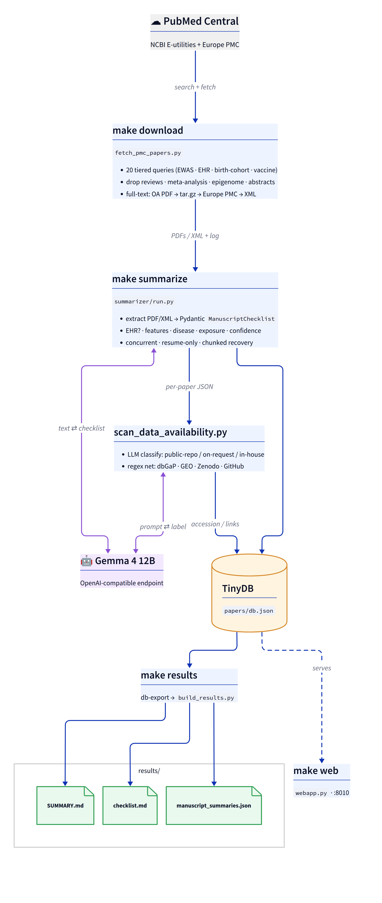

# Pediatric Exposome / EWAS Literature Collection

A reproducible pipeline that searches PubMed Central for **pediatric / childhood
environmental-exposure (exposome / EWAS) studies** and **pediatric
vaccine/immunization-exposure studies**, using EHR, administrative / claims, or
linked cohort data, downloads the open-access full text, summarizes each
manuscript with **Gemma 4 12B**, and captures **data-availability** (accession
numbers / repository links) for systematic-review work.

> **Current collection: 122 full-text papers**, 1990–2026, **22 EHR-based**.
> See [`paper_summary.md`](./paper_summary.md) for the inventory.

## Quick start

```bash
make setup      # create .venv + install deps (requests, openai, pypdf, pydantic, tinydb, dagster)
make download   # pediatric PMC fetcher (incremental — skips what's on disk)
make summarize  # Gemma 4 12B -> per-paper + combined JSON (concurrent; --workers via SUMMARIZE_ARGS)
make results    # export readable results/ (SUMMARY.md, checklist.md, combined JSON)
make test       # unit tests (no live API calls)
```

`papers/` (PDFs, XML, `download_log.json`, TinyDB `db.json`) is tracked in
Git — large/binary files (`*.pdf`, `*.xml`, `db.json`) go through **Git LFS**
(see `.gitattributes`); run `git lfs install` once after cloning.

## Pipeline overview

<table>
<tr><td align="center">

</td></tr>
<tr><td>

**Figure 1. End-to-end literature pipeline.** From **PubMed Central**, `make download` fetches and filters open-access full text (20 tiered queries; reviews / meta-analyses / epigenome / conference abstracts dropped; full-text fallback OA PDF → tar.gz → Europe PMC → JATS XML). `make summarize` extracts each manuscript into a Pydantic `ManuscriptChecklist` via **Gemma 4 12B**, and `scan_data_availability.py` classifies data availability (public-repo / on-request / in-house / …) with a regex safety-net for accession links (dbGaP · GEO · Zenodo · GitHub). Both LLM stages round-trip with Gemma and write to the **TinyDB** store (`papers/db.json`), the single source of truth. `make results` exports it to `results/` (`SUMMARY.md`, `checklist.md`, `manuscript_summaries.json`) and `make web` serves it as a browsable app on `:8010`.

</td></tr>
</table>

> The diagram is generated from [`docs/pipeline.d2`](./docs/pipeline.d2). Edit
> that source and re-render with
> [d2](https://d2lang.com): `d2 --layout elk docs/pipeline.d2 docs/pipeline.svg`.
> The committed **PNG** is what renders on GitHub — an SVG's `foreignObject`
> text labels are stripped by GitHub's sanitizer, so embed the PNG, not the SVG.

The same graph is orchestrated as **Dagster assets** (`pipeline.py`) — the
lineage `download_log` → `per_paper_summaries` → `data_availability_scan` →
`manuscript_summaries` → `results`. Run the UI with `make dagster` or
materialize headlessly with `make materialize`.

## Manuscript summarization (Gemma 4 12B → Pydantic JSON)

Each manuscript is summarized into a structured **checklist** by **Gemma 4 12B**
via an external OpenAI-compatible endpoint, validated with a Pydantic schema.
`--workers N` runs papers concurrently (the OpenAI client is thread-safe;
bottleneck is network-bound LLM calls).

```bash
cp .env.example .env        # fill in GEMMA_API_KEY (never committed)
make summarize              # all manuscripts (resume-only, chunked recovery)
make summarize-paper PMC=PMC7145790   # single paper
python -m summarizer.run --recover --workers 4   # 4 concurrent
```

**Output:** `papers/summaries/<pmcid>.json` (one per paper) +
`papers/manuscript_summaries.json` (combined).

**Checklist schema** (`summarizer/schema.py`, `ManuscriptChecklist`):

| Field | Type | Description |
|-------|------|-------------|
| `pmcid` / `title` / `year` | str | identity (from download log) |
| `ehr_used` | bool | does the study use EHR/EMR/claims/admin data? |
| `ehr_evidence` | str | sentence(s) justifying `ehr_used` |
| `summary` | str | 2-4 sentence summary |
| `key_findings` | list[str] | main results |
| `captured_features` | list[str] | EHR features/variables captured |
| `pathologies_diseases` | list[str] | disease(s)/outcome(s) |
| `study_design` / `data_source_type` / `population` / `exposure_domain` | str | review fields |
| `limitations` | list[str] | stated limitations |
| `confidence` | high\|medium\|low\|unclear | fit for a pediatric EHR/exposome review |
| **`data_availability`** | enum | public-repository\|available-upon-request\|in-house\|supplementary-only\|not-stated |
| **`data_accession_links`** | list[str] | accession IDs / repository URLs / names |
| **`data_availability_statement`** | str | verbatim sentence(s) justifying the call |
| `source_format` / `model` | str | provenance |

The model wraps JSON in chain-of-thought, so the client uses a strict
fixed-key prompt, robust fenced/balanced-JSON extraction with light repair for
truncated responses, lenient field validators, and a retry-with-nudge loop.

## Data-availability scan

[`scan_data_availability.py`](./scan_data_availability.py) asks Gemma 4 12B
(32k-token budget, pydantic-validated) **only** about how a study's data can be
obtained, in a focused window around the "Data availability" section. A
deterministic regex safety-net supplements any accession/URL (dbGaP / GSE /
PRJEB / Zenodo / GitHub / figshare / Dryad) the model drops, and repairs URLs
broken across PDF line wraps.

```bash
python scan_data_availability.py                 # all papers
python scan_data_availability.py --limit 5       # pilot
python scan_data_availability.py --workers 4     # concurrent
```

Latest scan (122 papers): 96 not-stated, 10 supplementary-only,
7 available-upon-request, **7 public-repository** (with accession/links), 2 in-house.

## TinyDB store

[`database.py`](./database.py) + [`db.py`](./db.py): a TinyDB-backed document
store that validates every record through `ManuscriptChecklist` (the catalog
can never drift into a state `build_results.py` can't read). The DB is the
source of truth for the combined file.

```bash
make db-import    # papers/summaries/*.json -> papers/db.json
make db-export    # store -> combined + results/manuscript_summaries.json
make db-stats     # record counts
python db.py find --ehr-used --disease asthma
python db.py update PMC1234567 --no-ehr-used --ehr-evidence "n/a"
```

## Dagster orchestration

[`pipeline.py`](./pipeline.py) wraps the existing scripts as assets with
lineage: `download_log` → `per_paper_summaries` → `data_availability_scan` →
`manuscript_summaries` → `results`. The summarizer runs in `--recover` +
`--workers 4` mode, and the focused data-availability scan is a first-class
asset so `make materialize` reproduces the same enriched outputs as the manual
workflow.

```bash
make dagster       # UI + lineage browser (dagster dev -m pipeline)
make materialize   # materialize the whole graph headlessly
```

## Running in GitHub Actions

[`.github/workflows/pipeline.yml`](./.github/workflows/pipeline.yml) runs the
same Dagster graph (`dagster asset materialize -m pipeline --select "*"`) on a
GitHub-hosted runner, triggered manually from the Actions tab (or
`gh workflow run pipeline.yml -f workers=4 -f limit=2` for a pilot run), and
pushes the updated `papers/`, `results/`, and `paper_summary.md` back to the
branch that triggered it.

The Gemma endpoint is served publicly at `https://llm.bioinfolder.com/v1`
(behind Cloudflare), so a GitHub-hosted runner can reach it directly — no
VPN/tunnel needed. **One-time setup required before the workflow can run:**

1. Add `GEMMA_API_KEY` as a **repo secret** (Settings → Secrets and
   variables → Actions) — the real Gemma endpoint key.
2. Optionally set `GEMMA_BASE_URL` / `GEMMA_MODEL` as repo **variables** if
   they should differ from the code defaults.

`papers/*.pdf`/`*.xml`/`db.json` are tracked via **Git LFS**
(`.gitattributes`) — install it locally with `git lfs install` before
cloning/pulling, and be aware of GitHub's LFS storage/bandwidth quota (1 GB
free per repo/month; a data pack may be needed as the corpus grows).

## Data-collection process

Implemented in [`fetch_pmc_papers.py`](./fetch_pmc_papers.py) in seven stages:

1. **Search PubMed Central** (NCBI ESearch) — Tier 1–5 queries, `retmax = 200`,
   union of unique PMC IDs across tiers (a CAPPED warning is logged if any
   query's hit count exceeds `retmax`).
2. **Fetch metadata** (NCBI ESummary).
3. **Filter candidates** by title / pubtype — drop reviews / posters /
   educational, epigenome-only (non-environment), and conference abstracts
   (`P-1234` / `SAT-xxx` / conference-only journals). Adult-outcome negation
   (dementia, Alzheimer, midlife, menopause, older adults) is applied at the
   query level.
4. **Resolve full text** via cascading fallbacks — NCBI OA direct PDF → NCBI OA
   tar.gz (main PDF extracted, supplementary/appendix filtered out) → Europe PMC
   PDF → Europe PMC JATS XML.
5. **Validate full text** — PDFs by `%PDF-` magic + size > 20 KB; XML by not
   being `article-type="abstract"` and having a `<body>` with > 2 000 chars.
   Abstract-only records are discarded.
6. **Write** `papers/*.pdf | *.xml` and append to `download_log.json`
   (`downloaded` / `xml_only` / `failed` / `excluded` / `abstract_only`).
7. **Regenerate the inventory** — `build_summary.py` → `paper_summary.md`,
   grouped by exposure domain & health outcome.

## Search strategy

Every query ANDs in a pediatric population constraint
(`pediatric` / `paediatric` / `child` / `children` / `childhood` / `infant` /
`newborn` / `neonatal` / `adolescent` / `youth` / `early life` / `pediatrics`,
all `[Title/Abstract]`) so every retained hit is pediatric by construction.
Adult-only outcomes are negated at the query level to stop adult studies
leaking in via incidental "child" mentions.

| Tier | Rationale |
|------|-----------|
| 1 | Explicit `environment-wide` / `exposome-wide` association in pediatric populations |
| 2 | Environmental exposure × EHR/claims/admin data × pediatric (all in abstract) |
| 3 | Geospatial / area-deprivation exposure linked to pediatric EHR |
| 4 | Birth-cohort / linked-data pediatric exposome — broadened because most pediatric exposome research does not name "EHR" in the abstract |
| 5 | Pediatric **vaccine / immunization as the exposure** → health outcome (safety, febrile seizure, fever, asthma, infection, neurodevelopment, autoimmune); named vaccines MMR/DTaP/BCG/rotavirus/HPV/flu; exposure_domain tag `vaccine / immunization`. No EHR term required — vaccine studies are often registry/claims/cohort based |

## Full-text resolution & validation

Because many open-access papers have dead NCBI OA links, retrieval uses a
cascade of fallbacks: NCBI direct PDF → NCBI tar.gz extraction → Europe PMC
PDF → Europe PMC JATS XML. Every downloaded file is then **validated** as
genuine full text — PDFs by the `%PDF-` magic + minimum size, XML by checking
it is not an `article-type="abstract"` record and that it has a real `<body>`
(plus `<data-availability>` / `sec-type="data-availability"` from `<back>`) —
so abstract-only conference / supplement records that slipped past the title
filter are discarded rather than counted as papers.

## Output

| Path | Contents |
|------|----------|
| `papers/*.pdf` | Downloaded full-text PDFs (tracked via **Git LFS**) |
| `papers/*.xml` | JATS-XML full text where no PDF was resolvable (tracked via **Git LFS**) |
| `papers/download_log.json` | Audit log: `downloaded`, `excluded`, `failed`, `abstract_only`, `xml_only`, `papers` (tracked) |
| `papers/summaries/<pmcid>.json` | One checklist per paper (tracked) |
| `papers/db.json` | TinyDB document store (tracked via **Git LFS**, source of truth) |
| `papers/manuscript_summaries.json` | Combined `SummaryBatch` JSON (tracked, regenerated by the store) |
| `results/manuscript_summaries.json` | **Tracked** combined copy |
| `results/SUMMARY.md` / `results/checklist.md` | **Tracked** readable inventory (word-boundary cell clipping) |
| `paper_summary.md` | Human-readable inventory grouped by exposure domain and health outcome |

## Static site (GitHub Pages)

A self-contained, Tailwind-styled site in [`docs/`](./docs/) presents the
headline stats, the pipeline figure, and a **searchable / filterable / sortable
inventory** of every summarized paper (embedded from the combined JSON, so no
runtime fetch). Once Pages is enabled it is served at
**`https://hyunhwan-bcm.github.io/exposome-ehr-review/`**.

```bash
make site          # regenerate docs/index.html + docs/tailwind.css from results/
```

`build_site.py` writes `docs/index.html` (data embedded inline) and the Tailwind
CLI builds a minified `docs/tailwind.css` containing only the classes the page
uses. Both are committed so Pages needs no build step.

**Enable Pages (one-time):** repo **Settings → Pages → Build and deployment →
Source: _Deploy from a branch_ → Branch: `main`, folder: `/docs`** → Save.
After `docs/` is on `main`, the site publishes at the URL above within a minute.
`docs/.nojekyll` disables Jekyll so all assets serve verbatim.

## Files

| File | Purpose |
|------|---------|
| `fetch_pmc_papers.py` | Search + filter + download pipeline |
| `build_summary.py` | Regenerates `paper_summary.md` from the download log |
| `build_results.py` | Exports readable `results/` from the combined JSON |
| `build_site.py` | Generates the static GitHub Pages site (`docs/index.html`) from the combined JSON |
| `summarizer/` | Manuscript summarization (Pydantic schema + Gemma client + extractor + runner) |
| `scan_data_availability.py` | Focused LLM + regex scan for data-availability / accession links |
| `database.py` / `db.py` | TinyDB store + CRUD CLI |
| `pipeline.py` / `pipeline_ops.py` | Dagster asset orchestration (fetch → summarize → combined → results) |
| `Makefile` | `setup` / `download` / `summarize` / `results` / `db-*` / `dagster` / `materialize` / `test` targets |
| `paper_summary.md` | Generated inventory (do not hand-edit) |